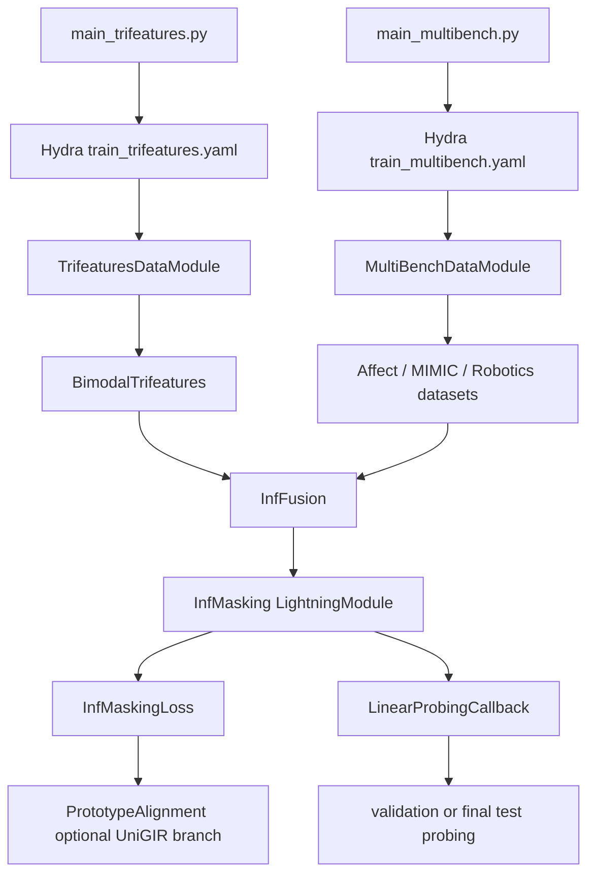

# 项目架构与依赖说明

更新时间：2026-09-24

本文档记录代码入口、配置入口、数据模块、模型模块、评测模块和测试之间的关系。后续 Agent 先读本文档，再决定需要加载哪些文件。当前项目没有单独的服务层，也没有数据库或在线接口。

## 代码入口

Trifeatures 的入口是 `main_trifeatures.py`。它通过 `configs/train_trifeatures.yaml` 组合 data、model 和 trainer 配置，构造 `TrifeaturesDataModule`、`InfMasking` 和 `LinearProbingCallback`。

MultiBench 的入口是 `main_multibench.py`。MOSI 等真实数据通过 `configs/train_multibench.yaml` 或 `configs/train_multibench_all-mod.yaml` 选择模态、编码器和任务；UniGIR 通过 `model=unigir` 复用 `InfMasking` 模型入口，并在 `InfMaskingLoss` 中打开 `PrototypeAlignment`。

两个训练入口都把 checkpoint 保存放在训练主流程中，不依赖 probing 是否开启。MultiBench 每个实验使用独立的实验根目录和 `checkpoints` 目录，每个 epoch 保存 `last.ckpt`；训练重启时显式 `resume_ckpt_path` 优先，否则自动查找当前实验目录的 `last.ckpt`。

## 模块边界

| 模块 | 主要文件 | 输入 | 输出 | 依赖方向 |
|---|---|---|---|---|
| 训练入口 | `main_trifeatures.py`、`main_multibench.py` | Hydra 配置 | Lightning fit/test | 依赖配置、数据、模型、评测 |
| Trifeatures 数据 | `dataset/trifeatures.py` | 数据根目录、pair 参数、数据 seed | 两个图像视图和任务标签 | 被训练入口依赖 |
| MultiBench 数据 | `dataset/multibench.py`、`dataset/affect/get_data.py` | 数据文件、模态、split | 多模态序列和标签 | 被训练入口依赖 |
| 表征模型 | `models/inffusion.py`、`pl_modules/infmasking.py` | 多模态输入 | full/masked 表征 | 被训练模块依赖 |
| 基础损失 | `losses/infmasking_loss.py` | full/masked 表征 | InfMasking loss 和日志指标 | 依赖可选 profile 分支 |
| UniGIR 分支 | `losses/prototype_alignment.py` | full 表征、masked 表征、prototype queue | profile loss 和诊断指标 | 只被基础损失依赖 |
| 下游评测 | `evaluation/linear_probe.py` | train/validation/test 特征 | acc、ROC AUC 等 | 通过 `extract_features` 接口依赖模型 |
| 测试 | `tests/` | 独立模块或回调 | 行为断言 | 不被生产代码依赖 |

模块依赖方向保持为：入口 → 配置与数据 → 模型 → 损失 → 可选 UniGIR 分支；评测通过模型提供的 `extract_features` 接口读取表征。当前未发现生产模块之间的循环依赖。

## 关键接口

### Trifeatures 数据接口

`TrifeaturesDataModule` 接受 `data_root`。当它为 `null` 时使用 `dataset/catalog.json` 中的默认目录；当它指向新目录时，数据类可以按新的数据 seed 生成独立 train/test 根目录。`BimodalTrifeatures` 的 `max_size` 表示 pair 数，`seed` 同时控制 pair 采样和 biased synergy 对的排列。

### UniGIR 接口

`InfMaskingLoss` 只有在 `profile_kwargs` 非空时创建 `PrototypeAlignment`。核心形式为：

$$
\mathcal{L}
=
\mathcal{L}_{\mathrm{InfMasking}}
+
\alpha\mathcal{L}_{\mathrm{profile}}.
$$

`PrototypeAlignment.forward` 接受完整视图、masked views 和可选的另一组 augmentation，返回 loss、KL、assignment entropy、target confidence、prediction usage entropy 和 prototype similarity 等标量。训练阶段更新 prototype 和 queue，评估阶段不更新。

### 评测接口

`LinearProbingCallback` 使用 `train_dataloader()` 拟合线性探针。`by_epoch` 使用 downstream validation split；`by_fit` 在训练结束时使用 validation split并记录 `final_*` 指标；`on_test_start` 才使用 downstream test split。正式 test 评测应通过 `mode=test` 和最后 checkpoint 单独启动。

## 运行约束

- Trifeatures 开发数据和正式确认数据必须使用不同的 `data_root`；
- 数据 seed 与模型 seed 分开记录；
- Trifeatures 正式确认时通过 `run_scripts/winpc_start_experiment.ps1` 显式传入 `DataRoot` 和 `PairSeed`，不能依赖默认数据目录或默认 pair seed；
- Baseline 和 UniGIR 使用相同模型 seed、数据根目录、pair 参数和训练预算；
- 当前默认 MultiBench 使用单设备、确定性训练和 `num_workers=0`，GPU 运行可在完成资源检查后显式覆盖；
- 正式训练默认使用 `by_fit` probing，不在训练过程中根据 test 指标选择 epoch 或 checkpoint；
- 每次只启动一个训练进程，日志和 checkpoint 使用独立目录；
- 代码变化后先运行 `tests`，再运行语法检查和 Hydra 配置解析。

## 已知限制

1. `main_multibench.py` 仍支持显式覆盖为 `by_epoch` 做诊断，但正式配置默认使用 `by_fit`；最终 test 需要单独用 `mode=test` 运行；
2. 当前本地没有 MOSI 数据文件，真实数据只能在下载和哈希记录完成后运行；
3. `environment.yml` 是原始 Linux/Conda 环境，当前 Windows `.venv` 是另一套环境，两者的版本和 CUDA 条件不能直接等同；
4. 当前没有自动生成实验版本清单的脚本，G0 仍需要补充一个轻量记录工具或固定模板；
5. 本文档记录的是当前代码结构，若模型、数据或评测接口变化，必须同步更新本文档和 `08_AGENT_CONTINUATION.md`。
