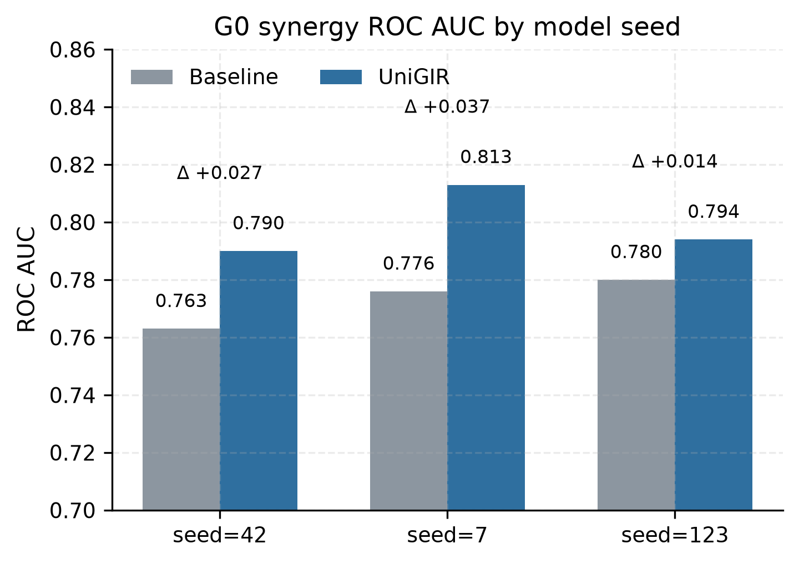
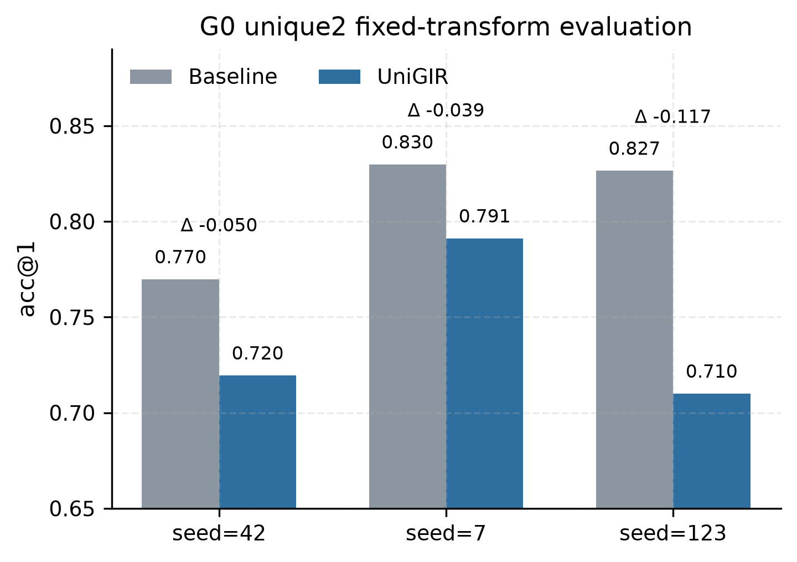
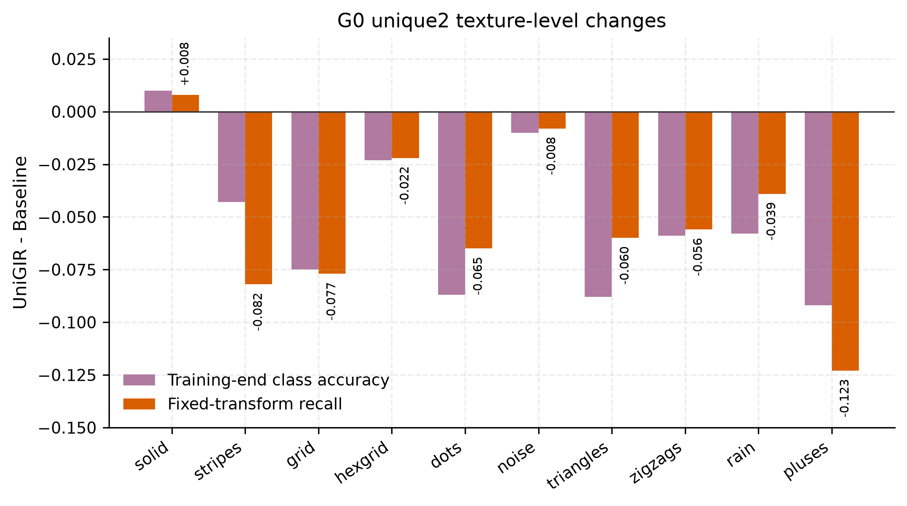

# UniGIR 结果章节草稿

更新时间：2026-09-25
用途：论文结果部分的第一版文字和图表编排。数字来自 G0 最终归档、unique2 固定变换评测、逐样本表示诊断和 MOSI 三 seed 对照。

## 4.1 实验设置

我在 InfMasking 的 masked-view 训练基础上加入单向 profile 目标。模型从一个视图的表征预测另一个视图的关系轮廓，当前配置使用 $K=128$ 个 prototype、queue size 为 1024、profile loss weight 为 $\alpha=0.25$。

G0 使用封存的 `trifeatures_g0_seed20260924` 数据，pair sampling seed 固定为 42，model seed 为 42、7、123。Baseline 和 UniGIR 使用相同的数据、训练预算和 probing 协议，训练 10 epoch。主要指标为 synergy ROC AUC，unique2 acc@1 作为保护指标，用于检查方法是否牺牲纹理信息换取协同信息。

## 4.2 G0 主要结果

表 1 给出三个 model seed 的均值、样本标准差和差值。差值按 UniGIR 减 Baseline 计算。

| 任务 | Baseline acc@1 | UniGIR acc@1 | acc@1 差值 | Baseline ROC AUC | UniGIR ROC AUC | ROC AUC 差值 |
|---|---:|---:|---:|---:|---:|---:|
| share | 0.937 ± 0.019 | 0.936 ± 0.024 | -0.001 ± 0.016 | 0.997 ± 0.002 | 0.997 ± 0.002 | 0.000 ± 0.001 |
| unique1 | 0.805 ± 0.003 | 0.808 ± 0.020 | +0.004 ± 0.017 | 0.974 ± 0.003 | 0.974 ± 0.004 | 0.000 ± 0.002 |
| unique2 | 0.771 ± 0.024 | 0.718 ± 0.038 | -0.053 ± 0.052 | 0.968 ± 0.006 | 0.956 ± 0.009 | -0.012 ± 0.012 |
| synergy | 0.536 ± 0.002 | 0.547 ± 0.024 | +0.010 ± 0.026 | 0.773 ± 0.009 | 0.799 ± 0.012 | +0.026 ± 0.012 |
| 四任务平均 | 0.762 ± 0.009 | 0.752 ± 0.018 | -0.010 ± 0.016 | 0.928 ± 0.003 | 0.931 ± 0.005 | +0.003 ± 0.006 |

图 1：G0 中三个 model seed 的 synergy ROC AUC。UniGIR 的差值分别为 `+0.027`、`+0.037` 和 `+0.014`，三个 seed 均为正，平均差值为 `+0.026`。

synergy ROC AUC 的正向变化在三个 seed 上重复出现，说明 profile 目标对协同信息的影响方向具有一定稳定性。synergy acc@1 只有 seed=7 提升，三个 seed 的平均差值为 `+0.010`，因此 ROC AUC 和 acc@1 需要同时报告。

## 4.3 unique2 保护指标和类别误差

训练末 probing 中，unique2 acc@1 在三个 seed 上均下降，平均差值为 `-0.053`。为了排除测试变换随机性，我对六个 checkpoint 做了固定变换下的只读配对评测。评测使用 `Resize(256) + CenterCrop(224)`，每个 seed 处理 4214 个 pair，同一 seed 的 Baseline 与 UniGIR 使用相同的 pair 顺序。

| model seed | Baseline acc@1 | UniGIR acc@1 | UniGIR - Baseline |
|---:|---:|---:|---:|
| 42 | 0.769815 | 0.719506 | -0.050308 |
| 7 | 0.829853 | 0.791172 | -0.038681 |
| 123 | 0.826531 | 0.710014 | -0.116516 |
| 三 seed 平均 | 0.808733 | 0.740231 | -0.068502 |

图 2：固定 test transform 下的 unique2 配对评测。三个 seed 的差值均为负，平均差值为 `-0.068502`。这说明 unique2 退化在固定评测变换下仍然存在。图中的绝对 acc@1 只用于同一评测协议内的配对比较，不能和训练末 `by_fit` probing 的绝对值直接合并。

类别级分析显示，退化集中在部分 texture 类别。

| texture | 训练末类别准确率平均差值 | 固定变换 recall 平均差值 | 两种分析中的下降次数 |
|---|---:|---:|---:|
| solid | +0.010 | +0.008 | 0/6 |
| stripes | -0.043 | -0.082 | 6/6 |
| grid | -0.075 | -0.077 | 4/6 |
| hexgrid | -0.023 | -0.022 | 4/6 |
| dots | -0.087 | -0.065 | 4/6 |
| noise | -0.010 | -0.008 | 5/6 |
| triangles | -0.088 | -0.060 | 4/6 |
| zigzags | -0.059 | -0.056 | 6/6 |
| rain | -0.058 | -0.039 | 4/6 |
| pluses | -0.092 | -0.123 | 6/6 |

图 3：texture 类别差值。`pluses`、`stripes` 和 `zigzags` 在训练末统计和固定变换复核中都保持下降；`pluses` 的固定变换 recall 平均下降为 `-0.123`。两种颜色来自不同评测协议，因此图中用于比较方向和类别分布，不合并为单一统计检验。

## 4.4 profile 和表示诊断

为了判断 unique2 退化是否来自 profile 分支完全失效，我使用与 unique2 probe 对齐的 `Sup + biased=false + task=unique2` 测试集合进行逐样本诊断。每个 seed 使用 4214 个 pair，诊断过程只做前向计算，不更新 checkpoint。

| 诊断指标 | seed=42 | seed=7 | seed=123 | 当前观察 |
|---|---:|---:|---:|---|
| profile accuracy | 0.813433 | 0.774876 | 0.791045 | profile 分支产生可测预测信号 |
| profile KL | 0.297759 | 0.379116 | 0.309919 | seed=7 较高，但不能解释全部退化 |
| prediction usage entropy | 0.937068 | 0.937717 | 0.931990 | 没有明显使用集中 |
| active prototypes | 99.05/128 | 93.61/128 | 98.21/128 | 没有明显 prototype collapse |
| masked distance 总体差值 | -0.0011 | -0.0046 | -0.0049 | masked 表征整体更接近完整表征 |

在 `pluses` 类别上，profile accuracy 均值为 `0.7762`，profile KL 为 `0.3756`，但 unique2 仍然在三个 seed 上下降。因此现有结果不能把退化解释为 profile 在这些类别上没有学到，也不能归因于明显 prototype collapse 或 masked 表征普遍不稳定。

当前更谨慎的解释是，profile 目标改变了 masked 与完整表征之间的几何关系，可能与 texture 线性分类需要的方向发生任务权衡。这个解释仍属于描述性假设，没有经过显著性检验、梯度归因或受控目标拆分实验。

## 4.5 MOSI 真实任务对照

为了检查 profile 约束强度是否可能造成任务权衡，我在 MOSI 上保持数据、seed、训练预算、queue、prototype 数量和 probing 协议不变，只将 $\alpha$ 从 `0.25` 改为 `0.125`。

| model seed | Baseline acc@1 / AUC | $\alpha=0.25$ acc@1 / AUC | $\alpha=0.125$ acc@1 / AUC | $\alpha=0.125-\alpha=0.25$ |
|---:|---:|---:|---:|---:|
| 42 | 0.573 / 0.655 | 0.641 / 0.704 | 0.641 / 0.715 | 0.000 / +0.011 |
| 7 | 0.559 / 0.627 | 0.587 / 0.642 | 0.607 / 0.664 | +0.020 / +0.022 |
| 123 | 0.608 / 0.671 | 0.636 / 0.717 | 0.557 / 0.652 | -0.079 / -0.065 |
| 三 seed 平均 | 0.580 / 0.651 | 0.621 / 0.688 | 0.602 / 0.677 | -0.020 / -0.011 |

$\alpha=0.125$ 的平均结果仍高于 Baseline，但低于 $\alpha=0.25$；seed=123 的两个指标均下降。因此降低 profile loss weight 没有稳定改善真实任务表现，当前主配置保留 $\alpha=0.25$。MOSI 没有 G0 的 unique2 标签，这项对照不能直接解释 texture 类别退化。

## 4.6 当前结论和限制

G0 的 synergy ROC AUC 在三个 seed 上均提升，unique2 acc@1 在三个 seed 上均下降，四任务平均 acc@1 下降 `-0.010`。固定变换配对评测重复观察到 unique2 退化，类别级分析显示退化集中在部分 texture 类别。profile 分支产生了可测信号，也没有明显 prototype collapse，但现有诊断不能给出 profile 导致具体类别错误的因果证明。

因此，当前把 G0 记为 `Uncertain`。结果支持把 UniGIR 写成一个对 synergy 有正向方向、同时带来 texture 保护指标代价的候选方法。当前证据不足以把它写成整体多任务性能稳定提升的方法，也不足以支持 100 epoch 训练收益的判断。

完整结果表、图注和来源见：

- [`19_论文与导师证据汇总.md`](19_论文与导师证据汇总.md)
- [`20_论文结果表与导师汇报草稿.md`](20_论文结果表与导师汇报草稿.md)
- [`21_论文图注与来源.md`](21_论文图注与来源.md)
- [`17_G0最终结果归档.md`](17_G0最终结果归档.md)
